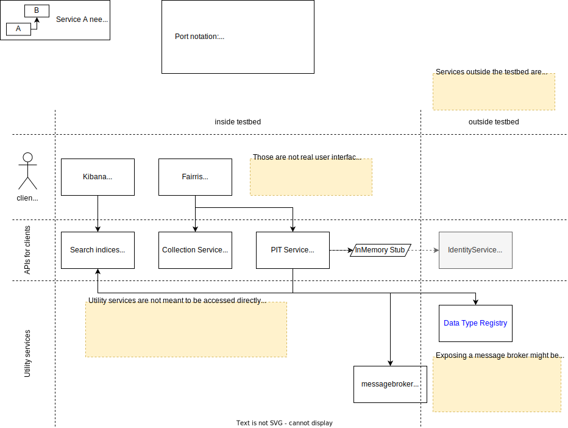
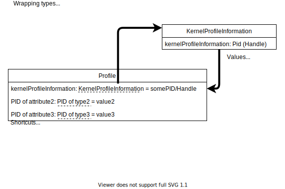
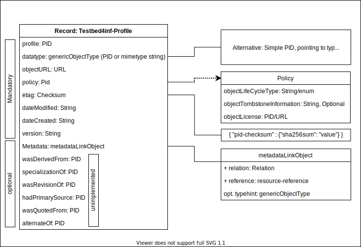

# FAIR DO Lab – Documentation

> Please note the documentation is still in progress and may not represent the current state properly.

For installation, general usage, updating and the repository structure, please take a look into the readme file at the root of this repository. This documentation aims to document the most important service communication workflows etc.

## Detailed topics

- [Creating FDO for an annotated image (example use case)](pageannotation.md)
    - Keywords: Aristoteles A04, PageAnnotation, XML, existing data
- [Search functionality / indexing records](search.md)
    - Keywords: messaging, federation, search, indexing, Elasticsearch, Kibana
- [Collections](collection.md)
    - Keywords: collection api, Fairris

# Configuration

You can find the configuration files of the services within this repository. They are usually used when building the images or creating the containers. Some services are directly provided as a docker image, so note that they may use their default configurations.

Some important notes about the current state of configuration:

- PIT-Service
    - By default, no real FAIR DOs get created, but are stored in memory to allow a trial-and-error-usage. In this case, you can view the PIT service API from the swagger web interface, which is accessible depending on your configuration i.e. under the following link: http://localhost:8090/swagger-ui.html
    - To switch to a real PID-Service (not to be confused by a PIT-Service) instead of the in-memory-storage, you need to remove the `pit.pidsystem.inmemory.baseURI` property from the configuration.

## Data Type Registry and Profiles

The Data Type Registry is not included in the FAIR DO Lab, instead an external DTR is used. This is required to share the included types and profiles across instances.

> Note: The cookbook now offers a better intoduction into this topic: <https://kit-data-manager.github.io/fairdo-cookbook/>
>
> The text below either needs to be revised or removed.

This is an overview of how it works, in case you want or need to. This is only important when defining profiles! In case you want to know how to register a PID record, simply use the PIT Service API. Also, the following is strongly implementation specific to the used data type registry. Still, it is something I want to keep documented as these are some of the core principles which need to be understood when defining new profiles.

Every attribute name of the profile is in practice represented by a pid, not a (normal) string. The attibute names here are just for readability. A pid is a unique string. An attributes pid has a type (which has also its own PID). The type defines the values allowed for an attribute. According to the [PID KernelInformation Recommendations][recommendations], a value should be indivisible, similar to primitive types in programming languages. This is illustrated in the following figure:

A profile defines mandatory and optional attributes. Some attributes are allowed to occur multiple times. In practice this means that the value may be some kind of array, depending of the used technologies (i.e. a JSON array). The following figure shows the currently used profile, which is an extension of the recommended kernel information profile. Things will change rapidly in the profiles section in 2021.

[recommendations]: https://www.doi.org/10.15497/A5BCD108-ECC4-41BE-91A7-20112FF77458
